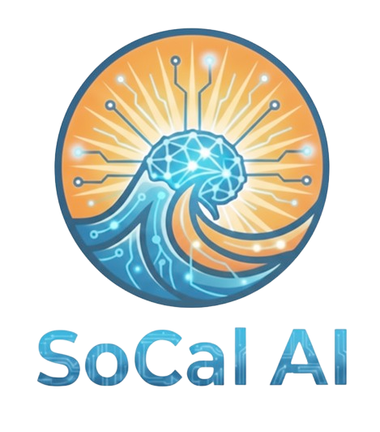
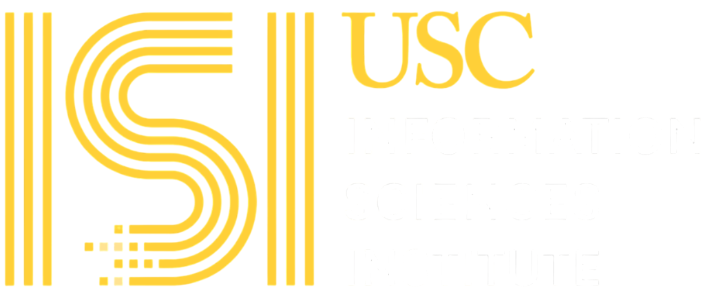
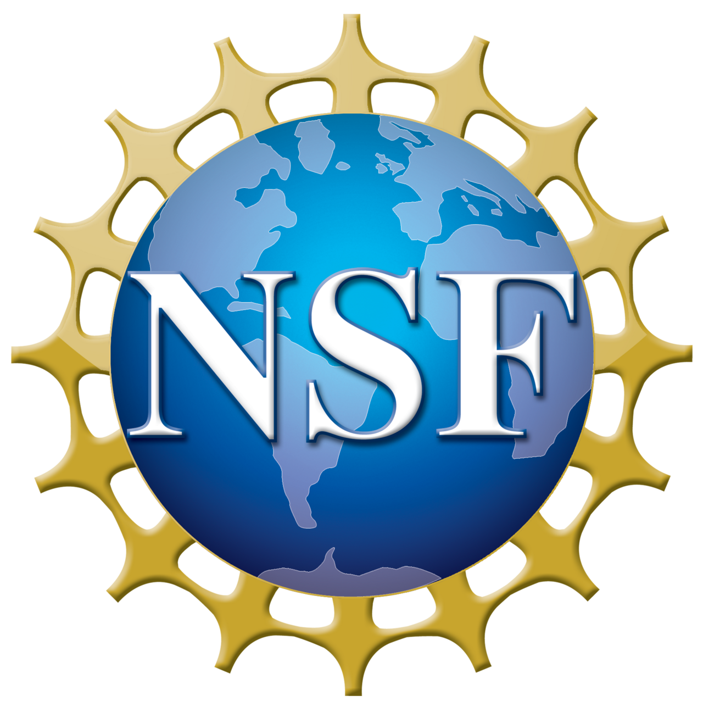

  

  # SoCal-AIRE
  ### Southern California AI for Research & Education

  

    <b>Uniting the region’s academic and research talent to advance the effective, responsible, and scalable integration of Artificial Intelligence.</b>
  

  
  
  

---

## 📖 About the Initiative

**SoCal-AIRE** is a multidisciplinary coalition designed to serve as a dynamic regional forum for knowledge exchange and capacity building. 

We bridge the gap between local innovations and major national resources. By connecting Southern California's research institutions with NSF-supported ecosystems—such as **ACCESS** and the **NAIRR**—we aim to democratize access to advanced computing and AI tools.

### Our Mission
To foster a collaborative environment where AI is integrated seamlessly into research pipelines and educational curricula, championing transparency, reproducibility, and ethical standards.

---

## 🎯 Core Activities

Our community operates through member-led initiatives focused on five key pillars:

* **🚀 Applied Innovation** Showcasing transformative AI use cases across diverse disciplines to demonstrate real-world impact in both the sciences and humanities.
* **🔗 Seamless Integration** Designing workflows that embed AI tools into established research pipelines and modernizing educational curricula.
* **🤝 Collaborative Exchange** Fostering peer-to-peer growth through expert talks, poster sessions, town halls, and community working groups.
* **🛡️ Ethical Standards** Championing transparency, reproducibility, and responsibility in the development and deployment of AI models.
* **💻 Infrastructure Access** Demystifying access to advanced computing and data resources, including regional clusters and national supercomputing allocations.

---

## ⚖️ Guiding Principles

We operate based on values that prioritize real results over hype:

1.  **Pragmatism:** Focusing on tangible results and realistic implementation.
2.  **Inclusivity:** Supporting participation across all institutions and career stages.
3.  **Integrity:** Encouraging ethical, transparent, and reproducible usage.
4.  **Connectivity:** Fostering connections across campuses and organizations.
5.  **Exchange:** Valuing shared problem-solving and peer-to-peer learning.

---

## 👥 Who It Is For

SoCal-AIRE is a broad tent open to all experience levels, from AI novices to advanced model builders.

* 🎓 **Faculty, Researchers & Students**
* 💾 **Cyberinfrastructure Professionals**
* 📚 **Curriculum Innovators & Educators**
* 🧪 **Domain Science Practitioners**

---

## 🏛️ Organization & Partners

The community is convened by the **ACCESS Support Team at USC’s Information Sciences Institute (USC/ISI)**, with guidance and participation from regional partners.

Activities are community-driven and evolve based on member interests and needs.

### Strategic Partners

   &nbsp;&nbsp;
   &nbsp;&nbsp;
   &nbsp;&nbsp;
  

---

## 📬 Get Involved

We invite institutions and individuals across Southern California to join the conversation.

* **Email Us:** [contact@socal-aire.org](mailto:contact@socal-aire.org)
* **Location:** Convened in Marina del Rey, CA (USC/ISI)

---

  © 2026 SoCal-AIRE. All Rights Reserved.

